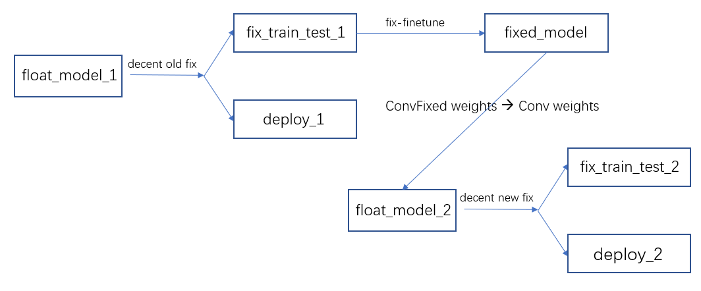

# DNNDK_Fix_Finetune
## Install DeePhi's DNNDK
1. Downloading DNNDK  
   DeePhi's DNNDK package could be freely downloaded after submitting registration information at DeePhi website http://www.deephi.com/technology/dnndk. The latest version v2.07 beta is publicly released in Oct. 2018.
2. Installing the DNNDK Host Tools  
   Make sure you have suitable CUDA and CUDNN's version.  
   ```bash
    ubuntu14.04/cuda_8.0.61_GA2_cudnn_v7.0.5
    ubuntu16.04/cuda_8.0.61_GA2_cudnn_v7.0.5
    ubuntu16.04/cuda_9.0_cudnn_v7.0.5
    ubuntu16.04/cuda_9.1_cudnn_v7.0.5
   ```
   If you have multiple CUDA, use symbolic link such as:
   ```bash
   ln -s /usr/local/cuda /usr/local/cuda-9.0
   ```
   Sometimes NCCL is necessary. After installation, `libnccl.so` is in `/usr/local/lib`, then:
   ```bash
   ln -s /usr/local/lib/libnccl.so.1 /usr/local/lib/libnccl.so.<version>
   ```
   Finally, 
   ```bash
   cd host_x86
   ./install.sh ZCU102
   ```

   If CUDA version conflict happens or libnccl can't be found, try 
   ```bash
   export LD_LIBRARY_PATH=/usr/local/cuda-9.2/lib64
   export LD_LIBRARY_PATH=/usr/local/lib
   ```

## Fix-Finetune Model
DeePhi's DNNDK doesn't support fix-finetuning Python's layers, so we need fix-finetuning our model without DNNDK and then load weights into caffemodel.  
The main process is shown below:
 

model name | float_model_1 | fix_train_test_1 | deploy_1 | fixed_model 
-|-|-|-|-
prototxt | Convolution | ConvolutionFixed | Convolution | ConvolutionFixed
caffemodel | float | float | float | float

model name | float_model_2 | fix_train_test_2 | deploy_2  
-|-|-|-
prototxt | Convolution | ConvolutionFixed | Convolution 
caffemodel | fixed | fixed | fixed 

Our work is based on that we have `fixed_model` now. 

### First step: get `ConvolutionFixed` weights (`params` in caffe)
In `class ConvolutionFixedLayer`, there are two layers: `ConvolutionLayer` (float) and `fixed_forward_conv_layer_` (fixed). We need to modify caffe source code to get `fixed_forward_conv_layer_`'s weights.   
In `test_fixed.cpp`:
```C
net_->Forward();
vector<shared_ptr<Layer<float> > > layers = net_->layers(); // get all layers
shared_ptr<ConvolutionFixedLayer<float> > convfixlayer =  static_pointer_cast<ConvolutionFixedLayer<float> >(layers[i]); 
shared_ptr<Layer<float> > fixed_layer = convfixlayer->fixed_layer();
/* test one layer's blobs */
shared_ptr<Blob<float>> one_layer = fixed_layer->blobs()[1];
const float* data = one_layer -> cpu_data();
```
`float* data` contains fixed weights and then we can save it.

### Second step: load `ConvolutionFixed` weights into `Convolution` weights
You can follow `get_fixed_conv_weights.ipynb` and `load_fixed_conv_weights.ipynb`. `get_fixed_conv_weights.ipynb` can transfer txt to npy. `load_fixed_conv_weights.ipynb` can get `float_model_2.caffemodel`.

## Decent quantize
In previous steps, we use `./testsim.sh decent` (modified from DNNDK v2.0.7). Now we get `float_model_2.caffemodel` and will use DNNDK v2.0.7 to fix it. Besides, we should feed data in this step.   
```bash
decent quantize -model float_model.prototxt -weights float_model.caffemodel -calib_iter 10 -gpu 1 
```
However, `fix_train_test_2.caffemodel` is encrypted and cannot be used to predict in Python. So we need to use `decent test`, which can write results to `fix_test.log`.
```bash
decent test -model /home/xuyf/test_decent/fix_results/fix_train_test.prototxt -weights /home/xuyf/test_decent/fix_results/fix_train_test.caffemodel -gpu 0 -test_iter 1 1> fix_test.log 2>&1
```
Besides, `decent test` can only be used when batch_size = 1. So we have to edit prototxt constantly as below:
```Python
def get_fix_feature(self, filename1, filename2):
    with open('/home/xuyf/test_decent/data/test_one_1.txt', 'w') as f:
        #print("{} 0".format(filename1), file=f)
        f.write("{} 0".format(filename1))
    with open('/home/xuyf/test_decent/data/test_one_2.txt', 'w') as f:
        #print("{} 0".format(filename2), file=f)	
        f.write("{} 0".format(filename2))	
    #assert(os.system('cd /home/xuyf/test_decent && . ./run.sh') == 0)
    assert(os.system('. /home/xuyf/test_decent/run.sh') == 0)
    count = 0
    featureshape = np.array([256,3,10])
    features = np.zeros(featureshape.prod(),dtype=np.float32)
    with open("./fix_test.log") as f:                          # open txt file
        for line in f:                                          # check line by line
            datalist = line.split()                             # split one line to a list
            if len(datalist) > 8:                               # jump over void line
                #if datalist[3] == 'net_test.cpp:305]' and datalist[4] == 'Batch' and datalist[6] == 'AddBackward73':
                if datalist[3] == 'net_test.cpp:305]' and datalist[4] == 'Batch' and datalist[6] == 'conv_5_pose':
                    features[count] = np.float32( datalist[8] )
                    # print("input %d: %g" %(count,features[count]))
                    count += 1
    assert( count == featureshape.prod() )
    #pdb.set_trace()
    return features.reshape([1,256,3,10])


net = caffe.Net("/home/xuyf/test/test_sqModel.prototxt", "/home/xuyf/Depth-VO-Feat-master/dnncfile/fixedresults/fixed_model.caffemodel",
    caffe.TEST)     # use test mode (e.g., don't perform dropout)
for cnt,seq in enumerate(self.eval_seqs):
    print "Getting predictions... Sequence: ", cnt, " / ",len(self.eval_seqs) 
    pred_poses[seq] = []
    seq_path = "/home/xuyf/Depth-VO-Feat-master/data/kitti_raw_data/" + self.eval_seqs_path[seq]
    start_idx = self.eval_seqs_start_end[seq][0]
    end_idx = self.eval_seqs_start_end[seq][1]
    for idx in xrange(start_idx, end_idx):
        img1_path = seq_path + "/image_02/data/{:010}.png".format(idx)
        img2_path = seq_path + "/image_02/data/{:010}.png".format(idx+1)
        '''
        img1 = self.getImage(img1_path)
        img2 = self.getImage(img2_path)
        self.odom_net.blobs['data'].data[0,:3] = img2
        self.odom_net.blobs['data'].data[0,3:] = img1
        self.odom_net.forward()
        pred_poses[seq].append(self.odom_net.blobs['SE3'].data[0,0].copy())
        '''
        feature = self.get_fix_feature(img1_path, img2_path)
        net.blobs['data'].data[...] = feature
        net.forward()
        pred_poses[seq].append(net.blobs['SE3'].data[0,0].copy())
```
However, we can notice that, `decent quantize` and `decent test` can only take effect to ConvolutionFixed layers. And the fc layers and python layers can't be processed. So we need to add fc and python layers to a new prototxt and caffemodel.
